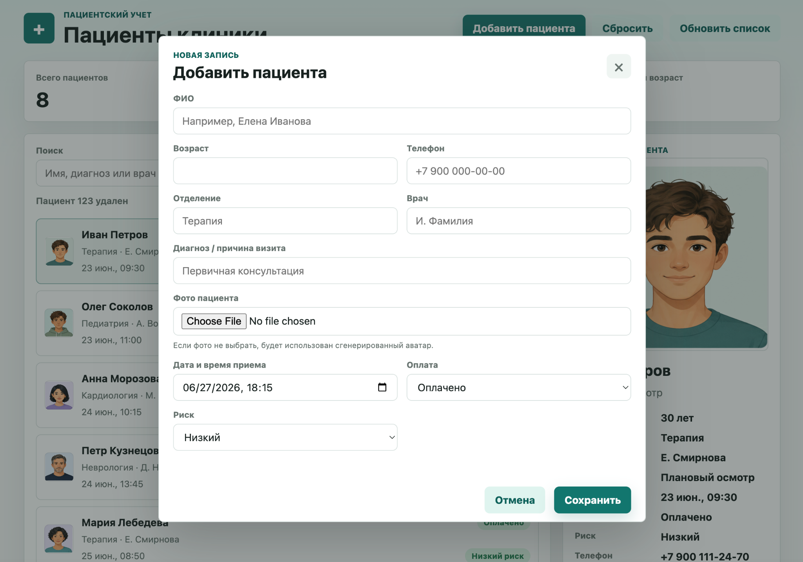
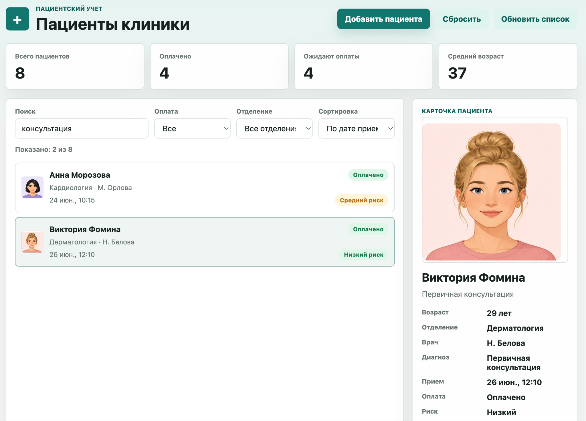

# Clinic Patients

Vanilla JavaScript app for managing patient cards, search, sorting, filtering and browser-side data persistence.

## Live Demo

[Open Live Demo](https://mrssstrange.github.io/clinic-patients/)

## Screenshots

### Main Dashboard


### Add Patient Form



### Search and Filtering



## Problem

Patient records need quick lookup, clear structure and simple browser-side organization. Clinic staff should be able to find patients, understand their context and sort records without unnecessary steps.

## Solution

Clinic Patients is a workflow-based UI for patient cards. It uses DOM rendering, forms, search, sorting, filters and `localStorage` to demonstrate practical JavaScript behavior without a framework or backend.

## Features

- Load demo patient list
- Add new patients through a form
- Upload patient photos
- Use generated avatars when no photo is selected
- Delete uploaded photos
- Delete patients
- Search by name, diagnosis or doctor
- Filter by payment status and department
- Sort by appointment date, name, age and risk level
- View detailed patient cards
- Calculate patient statistics
- Save added patients and uploaded photos in `localStorage`

## Tech Stack

- HTML5
- CSS3
- JavaScript
- DOM API
- LocalStorage
- GitHub Pages

## Patient Fields

Each patient record includes:

- Full name
- Age
- Phone number
- Department
- Doctor
- Diagnosis or visit reason
- Appointment date and time
- Payment status
- Risk level
- Patient photo or generated avatar

## Project Structure

```text
clinic-patients
├── assets
│   ├── clinic-patients-preview.png
│   ├── clinic-patients-card.png
│   └── clinic-patients-form.png
├── index.html
├── html.html
├── css.css
├── js.js
└── README.md
```

`index.html` is used for GitHub Pages. `html.html`, `css.css` and `js.js` contain the original working page, styles and application logic.

## How to Run

Open `index.html` in a browser. No installation required.

## What I Learned

- Rendering and updating lists with vanilla JavaScript
- Handling forms, user input and browser-side state
- Building search, sorting and filtering logic from arrays of records
- Persisting interface data with `localStorage`

## Next Improvements

- Edit patient modal
- Stronger validation
- Import/export JSON
- Visit history
- Pagination

## Data Storage

The project does not use a backend or database. Added patients, uploaded photos and deleted records are saved in browser `localStorage`.

## Author

**Ernest Muzafarov**  
Frontend Developer

[GitHub](https://github.com/MrSSStrange) · [LinkedIn](https://www.linkedin.com/in/ernest-muzafarov-919a323a2/)
