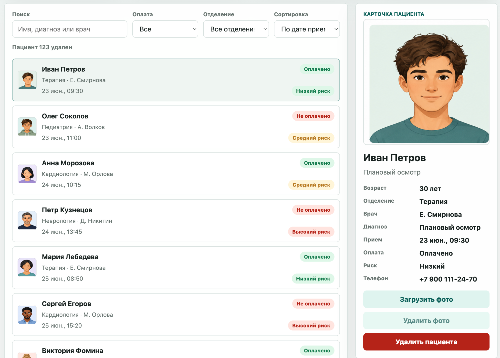

# Clinic Patients

JavaScript patient management app with forms, validation, search, filters and dynamic DOM rendering.

## 🚀 Demo

[Open Live Demo](https://mrssstrange.github.io/clinic-patients/)

---

## 📸 Screenshots

### Main Dashboard



### Patient Card


### Add Patient Form


---

## 🧰 Tech Stack

* HTML5
* CSS3
* JavaScript
* LocalStorage
* GitHub Pages

---

## ✨ Features

* Load demo patient list
* Add new patients through a form
* Upload patient photos
* Use generated avatars when no photo is selected
* Delete uploaded photos
* Delete patients
* Search by name, diagnosis or doctor
* Filter by payment status and department
* Sort by appointment date, name, age and risk level
* View detailed patient cards
* Calculate patient statistics
* Save added patients and uploaded photos in `localStorage`

---

## 📌 Project Idea

This project is a frontend application for managing clinic patient records.

The goal of the project is to practice working with forms, arrays, DOM rendering, filters, sorting, file uploads and browser storage without using a framework or backend.

The project is based on a medical workflow and is connected to real tasks from clinic support systems.

---

## 🧩 Patient Fields

Each patient record includes:

* Full name
* Age
* Phone number
* Department
* Doctor
* Diagnosis or visit reason
* Appointment date and time
* Payment status
* Risk level
* Patient photo or generated avatar

---

## 📁 Project Structure

```txt
clinic-patients
├── assets
│   ├── clinic-patients-preview.png
│   ├── clinic-patients-card.png
│   └── clinic-patients-form.png
├── index.html
├── html.html
├── css.css
├── js.js
└── README.md
```

`index.html` is used for GitHub Pages.
`html.html` is the original working page.
`css.css` contains the interface styles.
`js.js` contains the application logic.

---

## ▶️ How to Run

Open `index.html` in a browser.

No installation required.

---

## 💾 Data Storage

The project does not use a backend or database.

Added patients, uploaded photos and deleted records are saved in browser `localStorage`.

Data is stored locally in the current browser.

---

## 👤 Author

**Ernest Muzafarov**
Frontend Developer

[GitHub](https://github.com/MrSSStrange) · [LinkedIn](https://www.linkedin.com/in/ernest-muzafarov-919a323a2/)
